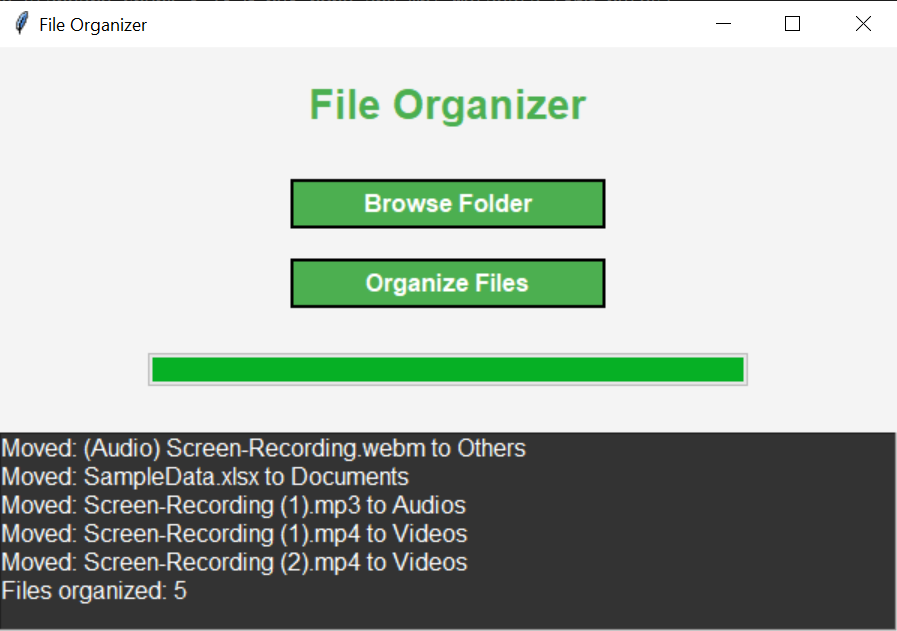

## Description:
FileOrg Pro is a sleek, intuitive, and powerful file management application built with Python and Tkinter. This tool offers users an easy and efficient way to organize, sort, and move files into designated folders based on their types, providing a clean and clutter-free workspace. The application features a user-friendly interface, customizable settings, and supports drag-and-drop functionality for a seamless user experience.

Whether you're a student, a professional, or anyone who handles a lot of files on a daily basis, FileOrg Pro will help you keep everything in order with minimal effort.

## Key Features:
- Drag-and-Drop File Sorting: Easily drag files into the app for automatic categorization based on file type (e.g., documents, images, audio files).

- Automatic Folder Organization: The app creates subfolders (e.g., "Documents", "Images", "Audio") to keep your files neatly organized.

- Customizable Settings: Adjust sorting rules, folder names, and other options to match your needs.

- Responsive User Interface: A visually appealing and responsive GUI built with Tkinter, providing an excellent user experience.

- Built-in Search Functionality: Quickly locate files within your folders using a powerful search feature.

- Simple Setup: No need for additional installations or complex configurations—just run the Python script.

## Installation:
Clone or download the repository.

Ensure that you have Python 3.x installed on your system.

The application only requires basic Python modules, which are included by default:

```bash
Tkinter (for the GUI)
os
shutil
datetime
```

Navigate to the folder containing the script in your terminal or command prompt.

#### Run the script:
```bash
python file_org_pro.py
```
## Usage:
**Drag and Drop**: Simply drag files onto the application window, and the program will automatically sort them into appropriate folders.

**Search**: Use the search bar to find specific files within your organized folders.

**Customize**: Go to the settings to change folder organization rules or add custom file types.

## Screenshot:

